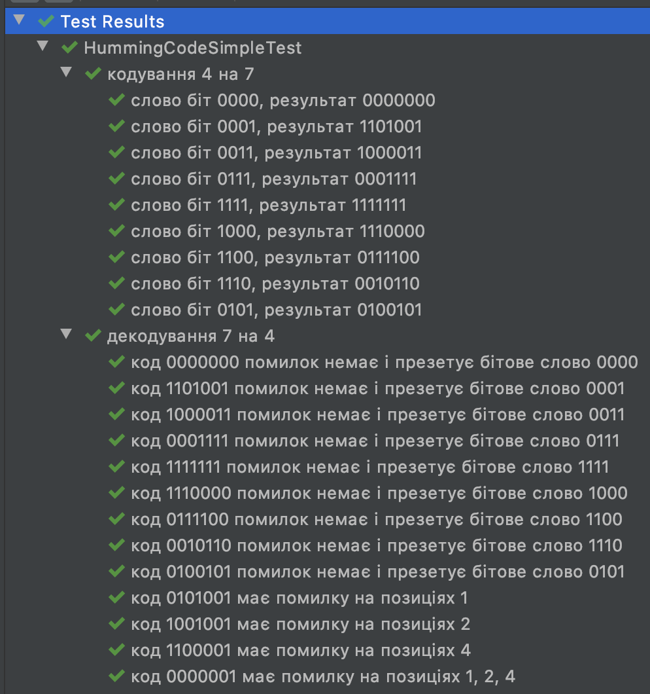

# Теорія інформації і кодування
- Алгоритм компресії Кодом Гаффмана. [Сирцевий код](https://github.com/tomkoptel/uzhnu-basics-of-ai-labs/tree/master/labs/src/main/kotlin/uzhnu/edu/toie/huffman). [Тести](https://github.com/tomkoptel/uzhnu-basics-of-ai-labs/blob/master/labs/src/test/kotlin/uzhnu/edu/toie/huffman/WeightTableTest.kt).
- Кодування та декодування кодом [Гемінга](https://uk.wikipedia.org/wiki/%D0%9A%D0%BE%D0%B4%D0%B8_%D0%93%D0%B5%D0%BC%D1%96%D0%BD%D0%B3%D0%B0). [Сирцевий код](https://github.com/tomkoptel/uzhnu-basics-of-ai-labs/tree/master/labs/src/test/kotlin/uzhnu/edu/toie/hamming/HummingCodeSimpleTest.kt).
Приклад виконання тесту.

## [Також є в доступі сайт котрий тільки кодує слово.](https://hamming.herokuapp.com/)
Сирцевий код сайту https://github.com/tomkoptel/hamming_code 

# Технології розподілених систем та паралельних обчислень
- [Проблема "Вечеря Філософів" рішення монітором та семафором](https://github.com/tomkoptel/uzhnu-basics-of-ai-labs/tree/master/labs/src/main/kotlin/uzhnu/edu/tdspc) та [тести](https://github.com/tomkoptel/uzhnu-basics-of-ai-labs/blob/master/labs/src/test/kotlin/uzhnu/edu/tdspc/Lab5Test.kt)
- 5 лабораторна робота реалізована на основі Kotlin Coroutines в якості інструменту розпаралелювання задач. [Повністю реалізована в тестовому середовищі.](https://github.com/tomkoptel/uzhnu-basics-of-ai-labs/blob/master/labs/src/test/kotlin/uzhnu/edu/tdspc/Lab3Test.kt)

# Методи та системи штучного інтелекту
- [prolog-lab](https://github.com/tomkoptel/uzhnu-basics-of-ai-labs/tree/master/prolog-lab) лабораторна робота з мови програмування Prolog
- [Сирцевий код реалізації фатичного діалогу](https://github.com/tomkoptel/uzhnu-basics-of-ai-labs/tree/master/labs/src/main/kotlin/uzhnu/edu/bai/dialog) та [тести](https://github.com/tomkoptel/uzhnu-basics-of-ai-labs/tree/master/labs/src/test/kotlin/uzhnu/edu/bai/dialog)

# Курсова робота
Дослідження особливостей кросс-платформенних розробок під Android та iOS з використанням Kotlin/Native for Native
- [app](https://github.com/tomkoptel/uzhnu-basics-of-ai-labs/tree/master/app) - сирцевий код Android додатку
- [ios](https://github.com/tomkoptel/uzhnu-basics-of-ai-labs/tree/master/ios) - сирцевий код iOS додатку
- [shared](https://github.com/tomkoptel/uzhnu-basics-of-ai-labs/tree/master/shared) - сирцевий мультиплатформений код написаний Kotlin Native
